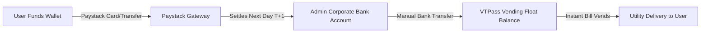

# Pay Lenses: Platform Operations Documentation (V1.0)

This documentation details the operational procedures, financial reconciliation cycles, configuration settings, and incident troubleshooting workflows for the Pay Lenses administration team.

---

## 1. Administrative Interfaces

### A. Accessing the Admin Console
Only accounts with emails containing `'admin'` or ending in `'@paylenses.com'` are permitted to access the admin portal:
1. Open the mobile app and log in with your administrator credentials.
2. Tap the **Profile** tab in the bottom navigation bar.
3. Tap **Admin Console**.
4. The admin portal is categorized into four control centers:
   * **Operations**: Support Desk & Audit Ledger.
   * **Accounting**: Income/Outflow financials & net platform liquidity tracker.
   * **Marketing**: Promo banners, SMS broadcast tools, and referral settings.
   * **Pricing**: Platform convenience fees controls.

---

## 2. Standard Admin Workflows

### A. Support Desk Management
Whenever a transaction fails on VTPass, the app automatically creates a support ticket.
1. In the **Operations** tab under **Support Tickets Desk**, pending tickets are flagged as `Escalated` with details of the failure reason.
2. Review the referenced transaction ID and customer profile name.
3. Once you verify the user's issue has been resolved (either by manual delivery or wallet refund), click **Resolve Ticket** to close the ticket.

### B. Adjusting Convenience Fees & Loyalty Rates
To tune the margins of the application, navigate to the **Pricing** tab in the Admin Console (or modify the `public.fees_config` table in Supabase directly):
* **Electricity Fee**: Convenience fee added to prepaid token vending (Default: `₦150.00`).
* **Cable TV Fee**: Convenience fee added to TV packages (Default: `₦150.00`).
* **Transfer Fee**: Convenience fee for outbound payouts (Default: `₦25.00`).
* **Referral Bonus**: Credit awarded to referring users (Default: `₦100.00`).
* **Points Rate**: The percentage ratio for converting loyalty points to cash (Default: `0.01` -> 1 Point = ₦1).

---

## 3. Financial Reconciliation & Settlement Lifecycle

Managing the cash loop between **Paystack (Inflow)** and **VTPass (Outflow)** is the core operational requirement for keeping the platform liquid.



### A. Managing the VTPass "Float"
Because Paystack settles funds on a **T+1 schedule** (money arrives next business day) but VTPass requires **instant pre-funded balances**, administrators must maintain a cash buffer:
1. **Pre-Fund VTPass**: Log into your VTPass Merchant Dashboard and ensure your developer vending wallet contains a minimum float (e.g., `₦100,000` to `₦500,000`).
2. **Daily Replenishment**: Every morning, check your corporate bank account for the previous day's Paystack settlement payout. 
3. **Top Up**: Instantly transfer those settled funds into your VTPass wallet to maintain your float equilibrium.

### B. Running Daily Reconciliation Checks
To ensure no discrepancy between user database wallets, Paystack settlements, and VTPass debits:
1. The **`daily-reconciler` Edge Function** runs automatically at 11:59 PM.
2. If you need to trigger it manually, execute a POST request to your Supabase Edge Function endpoint:
   `https://<project-id>.supabase.co/functions/v1/daily-reconciler`
3. Check the `public.settlement_ledger` table in the Supabase Dashboard:
   * **`matched`**: The transaction amount matches expected Paystack fees and VTPass wholesale costs.
   * **`discrepancy`**: Flagged when there is a difference greater than `₦1.00`.

---

## 4. Incident Management & Troubleshooting

### A. User Funded Wallet but Balance Did Not Update
This occurs if the Paystack webhook delivery failed or timed out.
* **Troubleshooting Steps**:
  1. Go to your **Paystack Dashboard** -> **Transactions**.
  2. Search for the user's email or transaction reference.
  3. If the transaction is "Successful" in Paystack but "Pending" or missing in the app:
     * Check your webhook logs in Paystack to see if there was a `500` or `504` error.
     * Manually credit the user's wallet via the Supabase Profiles SQL Editor:
       ```sql
       UPDATE public.profiles 
       SET wallet_balance = wallet_balance + <amount> 
       WHERE id = '<user-profile-id>';
       ```
     * Create a manual transaction record under `public.transactions` with category `wallet` and status `success`.

### B. VTPass Debited Float but Utility Was Not Delivered
This happens if the telecom provider has a network timeout during delivery.
* **Troubleshooting Steps**:
  1. Open the VTPass Merchant Console and search for the VTPass Transaction reference (`VTP-XXXXXXXX`).
  2. If the status is **"Refunded"** or **"Failed"** on VTPass, but the user's wallet was debited:
     * Navigate to the Support Ticket in the Admin Console.
     * Click **Resolve Ticket** and manually credit the user's wallet back.
  3. If the status is **"Successful"** on VTPass but the customer did not get the value:
     * Copy the VTPass transaction receipt token.
     * Share it with the user via Support Chat so they can verify directly with their network operator.
