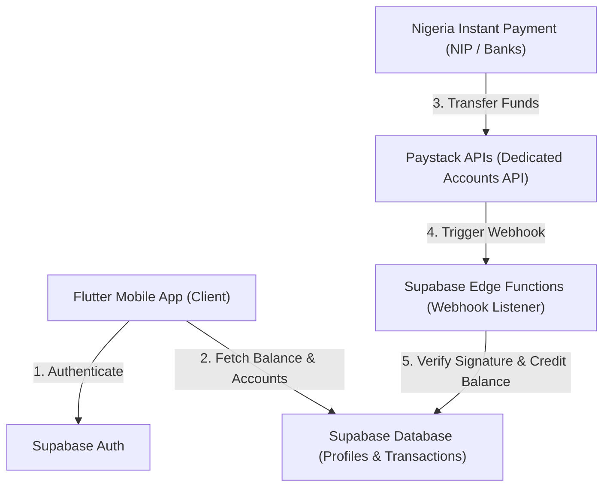
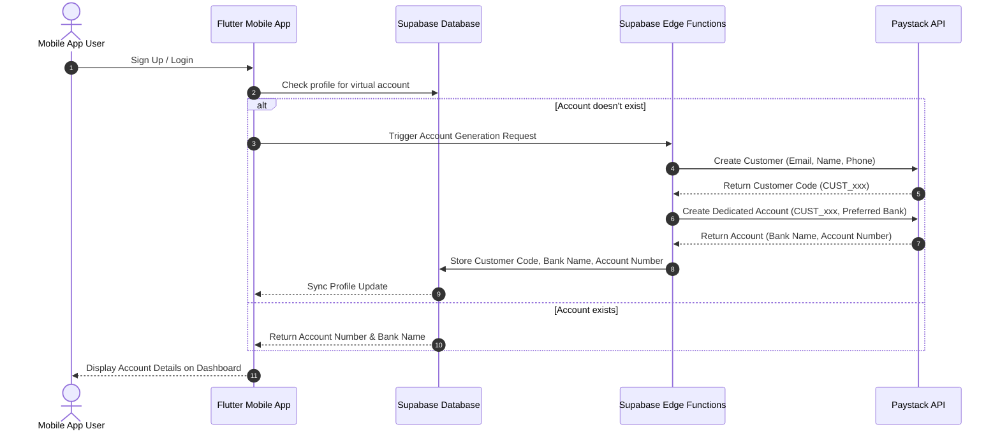
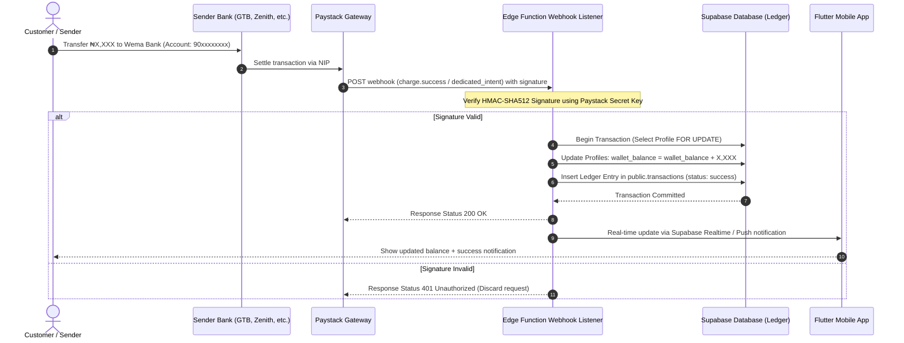

# System Architecture - Paystack-Powered Wallet & Virtual Accounts

This document defines the system architecture, data flow, and security guidelines for the Pay Lenses internally managed wallet system, powered by **Paystack Dedicated Virtual Accounts**.

---

## 1. System Components & Tech Stack



* **Client**: **Flutter Mobile App** structured with Clean Architecture (Presentation, Domain, Data layers).
* **Backend Backend-as-a-Service (BaaS)**: **Supabase**
  * **Supabase Auth**: Manages secure user registration and session tokens.
  * **Supabase Database**: Stores user wallet balances (`profiles` table) and ledger entries (`transactions` table) with strict **Row Level Security (RLS)**.
  * **Supabase Edge Functions**: Serves as our secure, serverless Webhook Listener verifying Paystack payloads.
* **Payment Processor**: **Paystack**
  * **Customers API**: Registers users as distinct Paystack customers.
  * **Dedicated Virtual Accounts API**: Generates and reserves dedicated account numbers (Wema/Titan Trust Bank) mapped to customers.
  * **Webhooks Engine**: Fires events on incoming transfers.

---

## 2. Core Operational Workflows

### A. Dedicated Virtual Account Provisioning Flow
This flow triggers when a new user registers or when an authenticated user without a virtual account loads the dashboard.



---

### B. Bank Transfer & Webhook Settlement Flow
This flow is triggered when a user transfers funds directly from their personal banking app or USSD terminal to their assigned virtual account.



---

## 3. Database Schema Mapping

### `public.profiles`
| Column Name | Type | Constraints | Description |
| :--- | :--- | :--- | :--- |
| `id` | `UUID` | `PRIMARY KEY, REFERENCES auth.users` | Unique user reference. |
| `full_name` | `TEXT` | `NOT NULL` | User full name. |
| `wallet_balance` | `NUMERIC(15,2)` | `DEFAULT 0.00, CHECK (wallet_balance >= 0)` | Instant balance. |
| `paystack_customer_code`| `TEXT` | `UNIQUE` | Paystack Customer reference (e.g. `CUST_xxx`). |
| `paystack_account_number`| `TEXT` | `UNIQUE` | Mapped bank account number. |
| `paystack_bank_name` | `TEXT` | `NOT NULL` | Partner bank name (e.g. `Wema Bank`). |

### `public.transactions`
| Column Name | Type | Constraints | Description |
| :--- | :--- | :--- | :--- |
| `id` | `UUID` | `PRIMARY KEY, DEFAULT gen_random_uuid()` | Ledger ID. |
| `profile_id` | `UUID` | `REFERENCES public.profiles(id)` | Associated user. |
| `title` | `TEXT` | `NOT NULL` | Title (e.g. `Wallet Funding`). |
| `amount` | `NUMERIC(15,2)` | `NOT NULL` | Positive for credit, negative for debit. |
| `reference` | `TEXT` | `UNIQUE, NOT NULL` | Unique transfer reference from Paystack. |
| `status` | `TEXT` | `CHECK (status IN ('success', 'pending', 'failed'))` | Transaction state. |

---

## 4. Security Architecture & Standards

### A. HMAC Webhook Authentication
To prevent fake credit attacks, the webhook listener must verify the Paystack signature:
* Paystack signs all payloads with a signature in the header `x-paystack-signature`.
* The server calculates the signature:
  $$\text{Signature} = \text{HMAC-SHA512}(\text{Paystack Secret Key}, \text{Raw Request Body})$$
* If the computed hash does not match `x-paystack-signature`, the server discards the request with `401 Unauthorized` and logs a warning.

### B. Database Concurrency & Race Conditions
To prevent double-credit or timing vulnerabilities when updating user balances, all balance adjustments must run inside a database transaction using row-level locking:
```sql
-- Conceptual balance update transaction
BEGIN;
SELECT wallet_balance FROM public.profiles WHERE id = 'user_uuid' FOR UPDATE;
UPDATE public.profiles SET wallet_balance = wallet_balance + 5000 WHERE id = 'user_uuid';
INSERT INTO public.transactions (profile_id, amount, reference, status) VALUES (...);
COMMIT;
```

### C. Row Level Security (RLS)
The app operates under strict multi-tenant constraints. Users can only select or query transaction history and account profiles belonging to their authenticated session (`auth.uid() = profile_id`).

---

## 5. Paystack Integration Guide (Secure Webhook Code & Secrets Placement)

### A. Step 1: Secure Secrets Configuration
Your Paystack API Secret Key must **never** be stored in the Flutter client code or committed to GitHub. Store it as a secure secret in your Supabase backend using the CLI:
```bash
# Set Paystack Secret Key in your Supabase project secrets
supabase secrets set PAYSTACK_SECRET_KEY=sk_test_your_secret_key_here
```

---

### B. Step 2: Paystack Webhook Handler (TypeScript Reference)
Deploy this code as a Supabase Edge Function (e.g. `supabase/functions/paystack-webhook/index.ts`) to receive secure instant deposit notifications from Paystack.

```typescript
import { serve } from "https://deno.land/std@0.168.0/http/server.ts";
import { createClient } from "https://esm.sh/@supabase/supabase-js@2";

// Import cryptographic library for signature verification
import { HmacSha512 } from "https://deno.land/std@0.168.0/crypto/mod.ts";

const PAYSTACK_SECRET = Deno.env.get("PAYSTACK_SECRET_KEY") ?? "";
const SUPABASE_URL = Deno.env.get("SUPABASE_URL") ?? "";
const SUPABASE_SERVICE_ROLE_KEY = Deno.env.get("SUPABASE_SERVICE_ROLE_KEY") ?? "";

serve(async (req) => {
  if (req.method !== "POST") {
    return new Response("Method not allowed", { status: 405 });
  }

  try {
    const rawBody = await req.text();
    const signature = req.headers.get("x-paystack-signature");

    // 1. Verify Webhook Authenticity (HMAC-SHA512 Signature verification)
    if (!signature) {
      return new Response("Missing signature header", { status: 401 });
    }

    const hmac = new HmacSha512(PAYSTACK_SECRET);
    const computedSignature = hmac.update(rawBody).toString();

    if (computedSignature !== signature) {
      console.warn("Unauthorized Paystack Webhook call detected!");
      return new Response("Invalid signature", { status: 401 });
    }

    // 2. Parse payload event
    const event = JSON.parse(rawBody);
    
    // We only process successful charges
    if (event.event === "charge.success") {
      const data = event.data;
      const customerEmail = data.customer.email;
      const amountInKobo = data.amount;
      const amountInNaira = amountInKobo / 100;
      const reference = data.reference;
      
      // Initialize Supabase Client with service role to bypass RLS for balance update
      const supabase = createClient(SUPABASE_URL, SUPABASE_SERVICE_ROLE_KEY);

      // 3. Prevent Double-Crediting (Check if transaction already processed)
      const { data: existingTx } = await supabase
        .from("transactions")
        .select("id")
        .eq("reference", reference)
        .maybeSingle();

      if (existingTx) {
        return new Response("Transaction already processed", { status: 200 });
      }

      // 4. Resolve user profile by email
      const { data: profile } = await supabase
        .from("profiles")
        .select("id, wallet_balance")
        .eq("email", customerEmail)
        .maybeSingle();

      if (!profile) {
        console.error(`User profile not found for email: ${customerEmail}`);
        return new Response("User not found", { status: 404 });
      }

      // 5. Update wallet balance & Insert transaction ledger record
      const { error: dbError } = await supabase.rpc("credit_user_wallet", {
        p_user_id: profile.id,
        p_amount: amountInNaira,
        p_reference: reference,
        p_provider: "Paystack",
        p_title: "Wallet Funding",
        p_subtitle: `Dedicated Transfer via ${data.authorization.bank || 'Bank'}`
      });

      if (dbError) {
        console.error("Database update error:", dbError);
        return new Response("Internal Server Error", { status: 500 });
      }

      console.log(`Successfully credited ${customerEmail} with ₦${amountInNaira}`);
    }

    return new Response("Event processed", { status: 200 });
  } catch (error) {
    console.error("Webhook execution failed:", error);
    return new Response("Bad request", { status: 400 });
  }
});
```

---

### C. Step 3: Database RPC Helper for Atomic Balance Sweep
To prevent balance race conditions, create this PostgreSQL function in your Supabase Database SQL Editor to execute the balance increment and ledger insert atomically:
```sql
CREATE OR REPLACE FUNCTION public.credit_user_wallet(
  p_user_id UUID,
  p_amount NUMERIC(15,2),
  p_reference TEXT,
  p_provider TEXT,
  p_title TEXT,
  p_subtitle TEXT
) RETURNS VOID AS $$
BEGIN
  -- Lock user profile row to prevent concurrent modifications
  PERFORM wallet_balance FROM public.profiles WHERE id = p_user_id FOR UPDATE;

  -- 1. Increment balance
  UPDATE public.profiles
  SET wallet_balance = wallet_balance + p_amount
  WHERE id = p_user_id;

  -- 2. Log ledger entry
  INSERT INTO public.transactions (profile_id, title, subtitle, amount, category, status, reference, provider)
  VALUES (p_user_id, p_title, p_subtitle, p_amount, 'wallet', 'success', p_reference, p_provider);
END;
$$ LANGUAGE plpgsql SECURITY DEFINER;
```
